# 电网基础知识培训

## 培训信息
- **时长**：30-40分钟
- **对象**：无电气背景的软件工程师
- **目标**：建立电网领域认知

---

## 1. 为什么会有电网

### 1.1 电力的产生与消费特性


**核心原因**：
- **发电集中化**：大电厂效率高、成本低，但位置偏远（水电站、煤矿、沿海风电）
- **用电分散化**：用户集中在城市、工业区，远离发电厂
- **供需实时平衡**：电能无法大规模储存，发用需实时平衡
- **资源共享**：互济互备，提高可靠性

---

## 2. 电网的发展历史

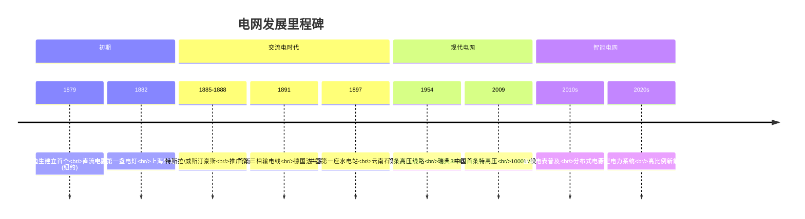

**发展驱动力**：
- 电压等级提升 → 输电距离增加、损耗降低
- 交流电取代直流电 → 变压器简单、易于远距离传输
- 电网互联 → 范围扩大、可靠性提升
- 智能化 → 自动化、信息化、互动化

---

## 3. 三相交流电原理

### 3.1 什么是三相交流电

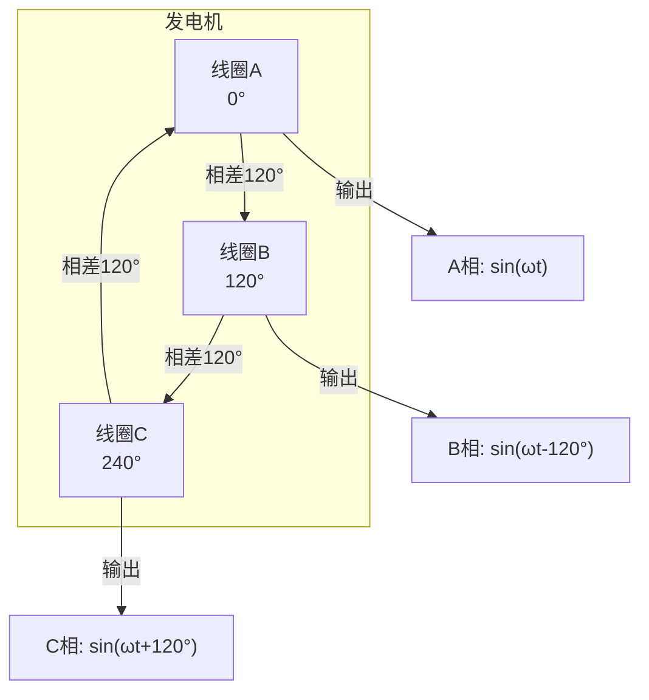

**三相电定义**：三个频率相同、幅值相等、相位互差120°的交流电

### 3.2 为什么三相平衡时总功率恒定？

```
功率瞬时值公式：
P_A = V·I·sin(ωt)·sin(ωt)
P_B = V·I·sin(ωt-120°)·sin(ωt-120°)
P_C = V·I·sin(ωt+120°)·sin(ωt+120°)

总功率 P_total = P_A + P_B + P_C

经过三角函数化简：
P_total = 1.5 × V × I = 常数！
```

**数学证明**（简化理解）：

```
三相瞬时值：
A相：sin(θ)
B相：sin(θ-120°) = -0.5sin(θ) - 0.866cos(θ)
C相：sin(θ+120°) = -0.5sin(θ) + 0.866cos(θ)

平方和相加：
sin²(θ) + [-0.5sin(θ) - 0.866cos(θ)]² + [-0.5sin(θ) + 0.866cos(θ)]²

= sin²(θ) + 0.25sin²(θ) + 0.75cos²(θ) + 0.25sin²(θ) + 0.75cos²(θ)
= 1.5sin²(θ) + 1.5cos²(θ)
= 1.5(sin²(θ) + cos²(θ))
= 1.5
```

**实际意义**：
- 电机运转平稳，无脉动
- 减少机械振动
- 延长设备寿命

### 3.3 三相电优势

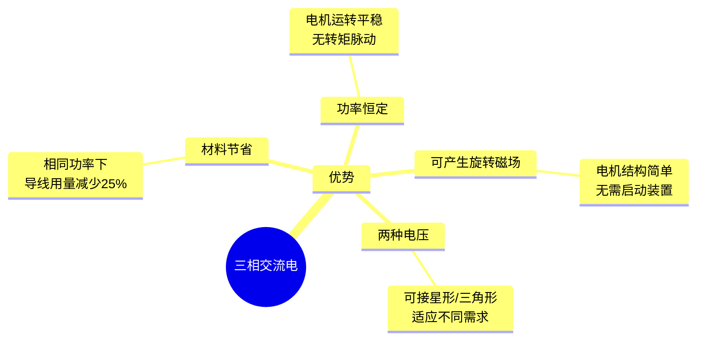

---

## 4. 相电压与线电压

### 4.1 连接方式

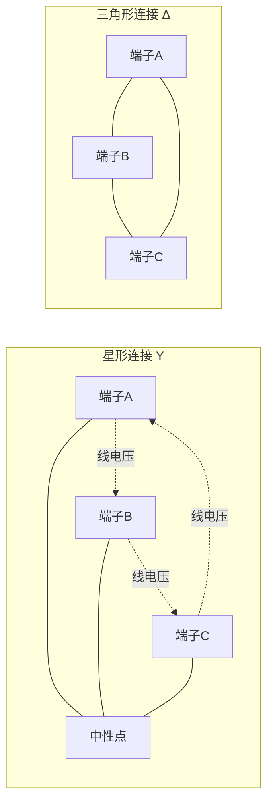

### 4.2 电压关系

| 参数 | 星形连接(Y) | 三角形连接(Δ) |
|------|-------------|---------------|
| 相电压 U_phase | U_phase = U_line / √3 | U_phase = U_line |
| 线电压 U_line | U_line = √3 × U_phase | U_line = U_phase |
| 线电流 I_line | I_line = I_phase | I_line = √3 × I_phase |

**记忆口诀**：
- 星形(Y)：线电压是相电压的√3倍，线电流等于相电流
- 三角形(Δ)：线电压等于相电压，线电流是相电流的√3倍

### 4.3 实际例子

```
380V/220V低压系统：
- 线电压：380V（两相之间）
- 相电压：220V（火线与零线之间）

验证：380V / √3 ≈ 220V ✓
```

---

## 5. 有功、无功、功率因数

### 5.1 概念类比（推车工作模型）

```
┌─────────────────────────────────────────────┐
│                                             │
│  推重物场景：工人推着一辆载重货车工作         │
│                                             │
│  ┌─────────────────────────────────────┐    │  有功功率 (P)
│  │  ────────▶  推车前进（真正做功）     │    │  = 推车前进的能量
│  │         重物位移 100米              │    │  产生实际效益
│  └─────────────────────────────────────┘    │
│                                             │
│  ┌─────────────────────────────────────┐    │  无功功率 (Q)
│  │  ↔ 维持身体平衡（调整重心）         │    │  = 维持状态所需的能量
│  │  来回摆臂但位置不变                  │    │  电感/电容储能-放能循环
│  │  不推车前进，但必须做这些动作        │    │  建立磁场/电场，维持电压
│  └─────────────────────────────────────┘    │
│                                             │
│  工人总体能力 S = √(P² + Q²)                │  视在功率 (S)
│  = 能提供的最大力量                         │  = 设备的额定容量
│                                             │
│  功率因数 cosφ = P/S                        │  = 推车占比
│  = 推车工作占总能力的比例                   │  = 电能利用效率
│                                             │
└─────────────────────────────────────────────┘

电网实际场景：
• 有功：转化为机械能、热能、光能（如电机转动、照明）
• 无功：电感/电容中的磁场/电场储能-放能（如变压器励磁）
       虽不直接做功，但维持电压稳定、建立工作磁场必需
```

### 5.2 定义对比

| 类型 | 符号 | 单位 | 含义 | 类比 |
|------|------|------|------|------|
| 有功功率 | P | 千瓦(kW) | 做有用功的能量 | 推车前进 |
| 无功功率 | Q | 千乏(kvar) | 电感/电容储能-放能 | 维持平衡 |
| 视在功率 | S | 千伏安(kVA) | 总容量能力 | 工人总能力 |
| 功率因数 | cosφ | 无 | 利用效率 | 推车占比 |

### 5.3 功率因数

```
cosφ = P / S = 有功 / 视在功率

意义：衡量电能利用效率
- cosφ = 1：100%利用，理想状态
- cosφ = 0.9：90%利用，常见水平
- cosφ < 0.9：效率低，可能罚款
```

**功率三角形**：

```
        │
        │ Q（无功）
    S   │
    ────┼────
       φ│
        └──── P（有功）

S² = P² + Q²
cosφ = P/S
```

### 5.4 为什么要关注功率因数？


**提升方法**：安装电容器组补偿无功

---

## 6. 电网电压等级与变压器

### 6.1 电压等级体系（中国）

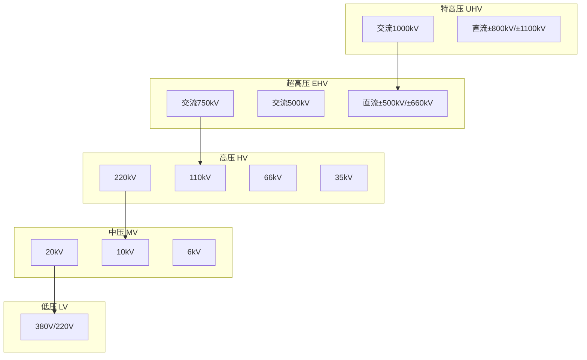

**典型等级与用途**：
| 电压等级 | 用途 |
|----------|------|
| 1000kV | 跨大区远距离输电（如西电东送） |
| 500kV | 省级主网架、大型电站送出 |
| 220kV | 地区主干网 |
| 110kV | 县级供电、大型工厂 |
| 10kV | 配电网主干线 |
| 380V/220V | 居民和商业用户 |

### 6.2 变压器原理

```
基本结构：
┌──────────────────────────────────────┐
│                                      │
│   一次绕组 N1     铁芯     二次绕组 N2
│   ┌──────┐      ╱╲╱╲╱╲      ┌──────┐
│   │  │   │     ╱        ╲     │  │   │
│   │  │   │    ╱   铁      ╲    │  │   │
│   │  │   │   ╱    芯       ╲   │  │   │
│   └──────┘  ╱              ╲  └──────┘
│   输入U1    ╲              ╱   输出U2
│             ╲_____________╱
│                                      │
└──────────────────────────────────────┘

变换关系：
U1/U2 = N1/N2  （电压与匝数成正比）
I1/I2 = N2/N1  （电流与匝数成反比）
P1 = P2        （功率守恒，理想情况）
```

**核心原理**：电磁感应
- 一次绕组通入交流电 → 产生交变磁场
- 磁场通过铁芯耦合到二次绕组
- 二次绕组感应出电压

**变压器作用**：
- 升压：降低输电损耗
- 降压：满足不同用电需求
- 电气隔离：安全隔离

### 6.3 典型输电链路

```
发电厂 ──10kV──► 升压变 ──500kV──► 500kV线路 ──500kV──►
降压变 ──220kV──► 220kV线路 ──220kV──► 降压变 ──110kV──►
110kV线路 ──110kV──► 降压变 ──10kV──► 10kV配电网 ──10kV──►
配电变 ──380V/220V──► 用户
```

---

## 7. 主要区域电网比较

### 7.1 对比总览

| 区域 | 频率 | 典型电压等级 | 特点 | 互联情况 |
|------|------|--------------|------|----------|
| 中国 | 50Hz | 1000/500/220/110/10/0.38kV | 特高压领先，坚强智能电网 | 全国统一同步电网 |
| 美国 | 60Hz | 765/500/230/115/13.8/0.48kV | 多个独立电网，私有化为主 | 东部、西部、德州三大独立 |
| 欧洲 | 50Hz | 400/220/110/20/0.4kV | ENTSO-E协调，跨国互联 | 同步互联覆盖35国 |
| 日本 | 50/60Hz | 500/275/154/66/6.6/0.2kV | 东西部频率不同 | 两个独立系统 |
| 澳洲 | 50Hz | 500/330/220/132/66/11/0.4kV | 孤岛运行，新能源占比高 | 五州独立 |
| 中东 | 50Hz | 400/380/132/33/11/0.4kV | 海湾互联，GCC电网 | 海湾六国互联 |

### 7.2 详细对比

#### 中国电网
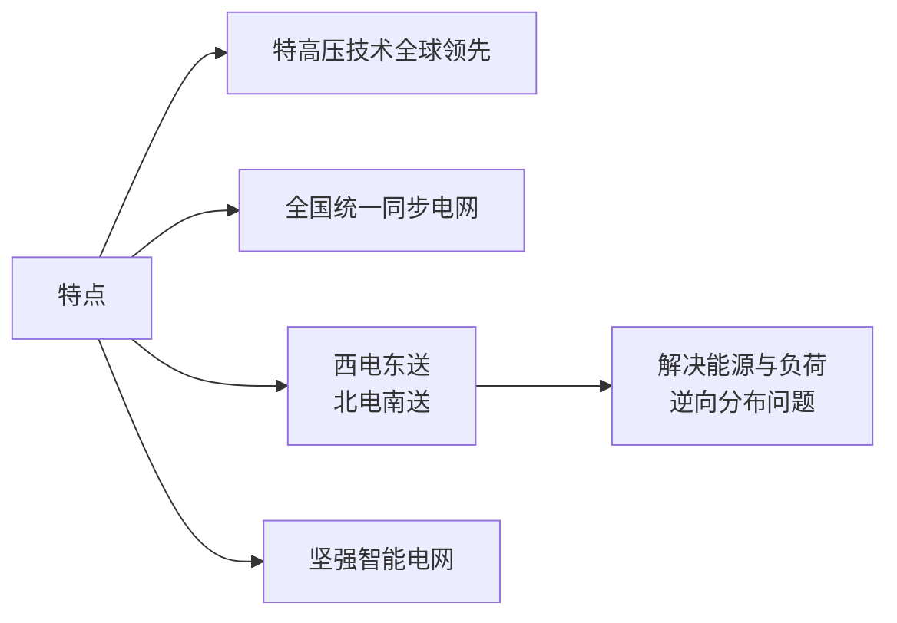

- **同步电网**：除港澳台外，全国基本同步
- **特高压成就**：1000kV交流、±1100kV直流世界领先
- **装机容量**：世界第一（约29亿千瓦，2023年）

#### 美国电网
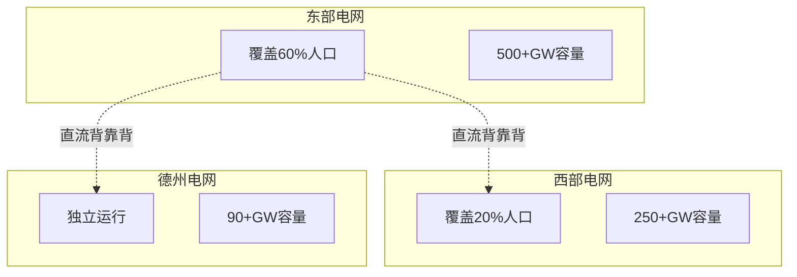

- **三大独立系统**：东部、西部、德州互不同步
- **所有制**：私有化为主，多个电力公司
- **可靠性挑战**：多次大停电（2003年美加大停电等）

#### 欧洲电网
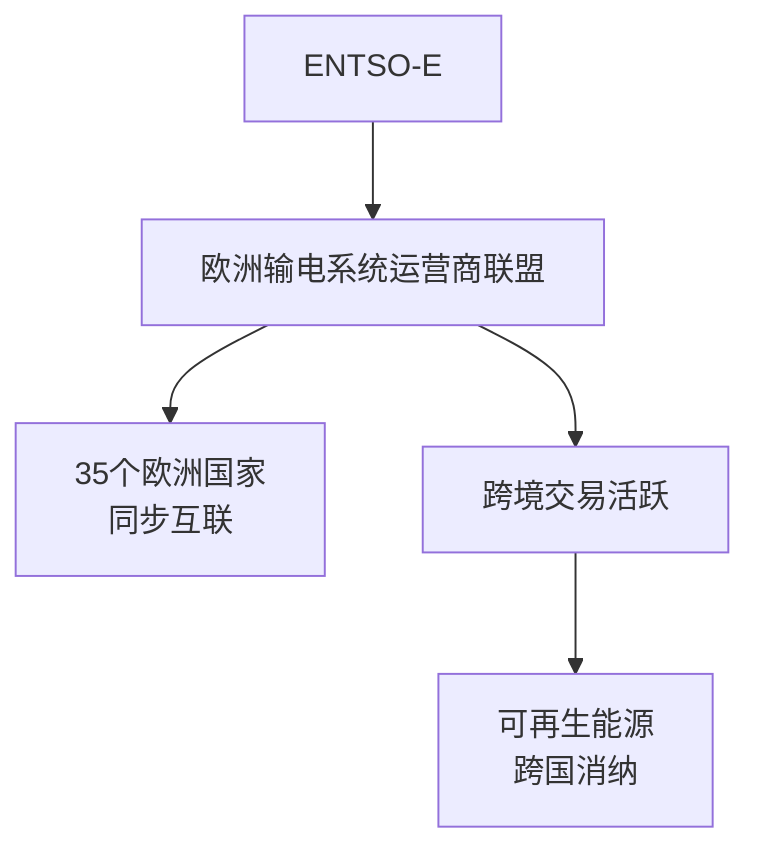

- **高度互联**：ENTSO-E覆盖35国
- **频率稳定**：50Hz，严格控制在±0.2Hz
- **市场化**：电力现货市场发达，跨国交易频繁

#### 日本电网
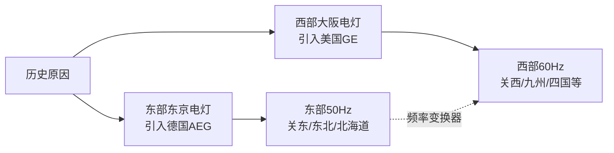

- **频率分割**：新泻县以东50Hz，以西60Hz
- **两大系统**：东部、西部独立运行
- **特殊挑战**：频率转换限制了东西部互济

#### 澳洲电网
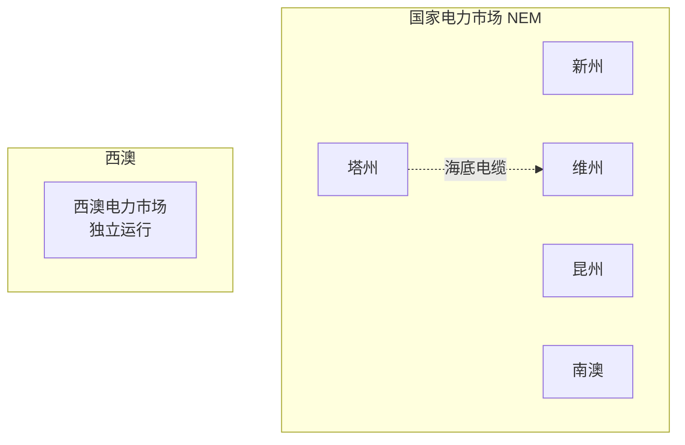

- **孤岛运行**：除NEM互联五州外，西澳独立
- **新能源先锋**：南澳可再生能源占比超70%
- **挑战**：分布式电源管理、频率稳定

#### 中东电网
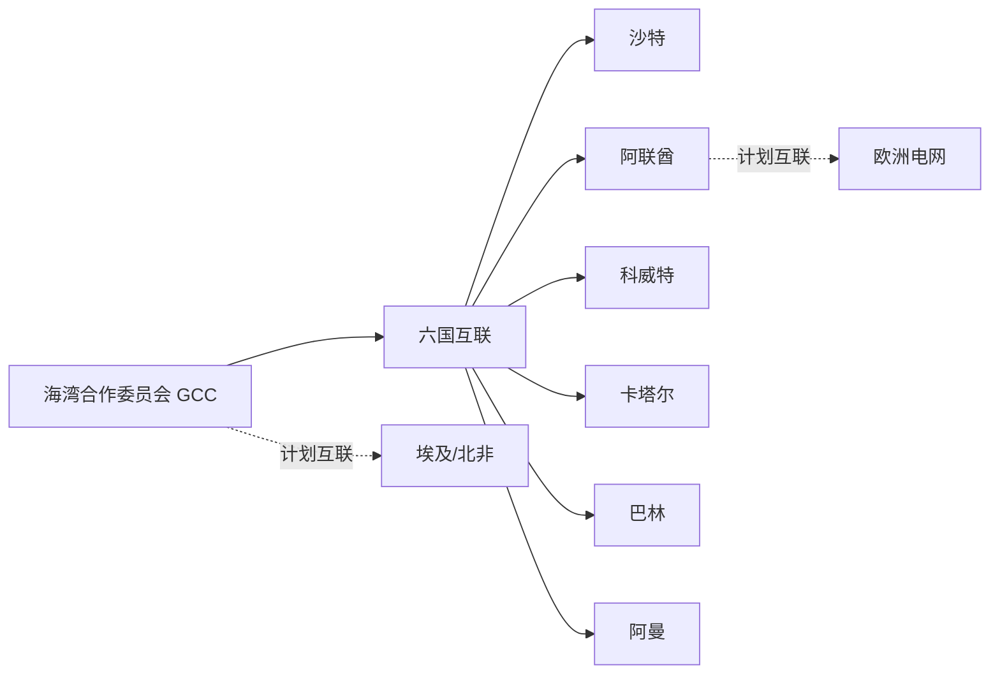

- **GCC电网**：海合会六国互联
- **发展快速**：中东地区电力需求增长快
- **未来互联**：计划与欧洲、北非连接

### 7.3 频率标准对比

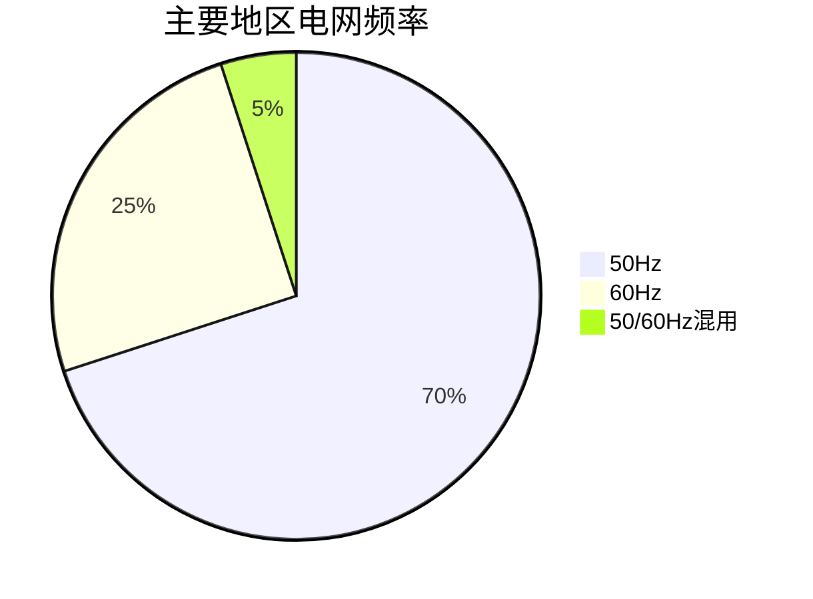

| 频率 | 采用地区 | 备注 |
|------|----------|------|
| 50Hz | 中国、欧洲、澳洲、中东等 | 世界主流 |
| 60Hz | 美国、加拿大、日本西部、韩国等 | 北美体系 |
| 混用 | 日本 | 东西部分割 |

### 7.4 电压标准对比

| 区域 | 低压标准 | 中压标准 | 高压标准 |
|------|----------|----------|----------|
| 中国 | 380V/220V | 10kV(主流) | 110kV/220kV/500kV |
| 美国 | 120V/240V | 13.8kV | 115kV/230kV/345kV |
| 欧洲 | 400V/230V | 20kV | 110kV/220kV/380kV |
| 日本 | 200V/100V | 6.6kV | 66kV/154kV/275kV |
| 澳洲 | 415V/240V | 11kV | 66kV/132kV/275kV |

---

## 8. 总结

### 8.1 核心概念回顾

```
电网基本要素：
├── 发电：集中化、多样化
├── 输电：高压/特高压、低损耗
├── 配电：中低压、广覆盖
└── 用电：实时平衡、质量要求

关键电气概念：
├── 三相电：效率高、功率恒定
├── 电压等级：适应不同传输距离
├── 功率：有功做功、无功建场、功率因数衡量效率
└── 变压器：电磁感应、电压变换
```

### 8.2 给软件工程师的启示

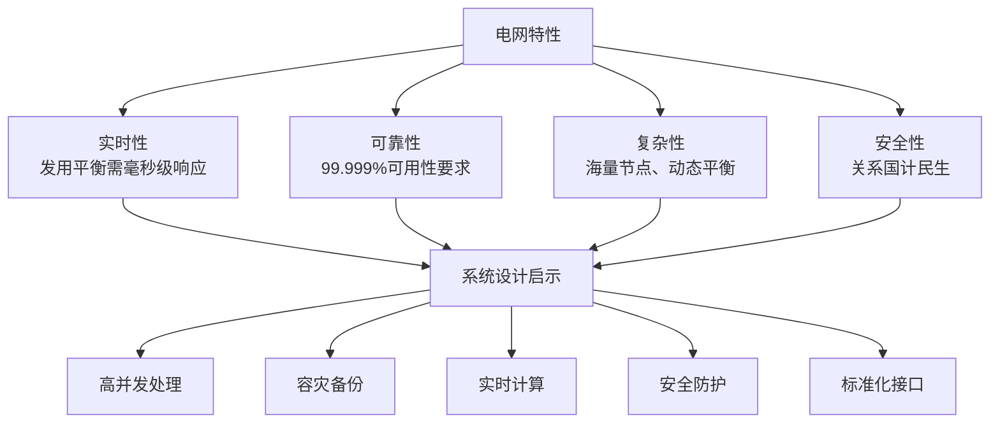

### 8.3 学习资源推荐

- **在线课程**：MIT OpenCourseWare - Electric Power Systems
- **标准规范**：IEC/IEEE标准、GB国家标准
- **专业书籍**：《电力系统分析》《现代电力系统》
- **行业资讯**：国家电网官网、CSEE期刊

---

## 附录：常用速查

### 功率公式速查
```
有功功率：P = √3 × U × I × cosφ
无功功率：Q = √3 × U × I × sinφ
视在功率：S = √3 × U × I
功率因数：cosφ = P/S
```

### 电压关系速查
```
星形连接：U_line = √3 × U_phase
三角形连接：U_line = U_phase
```

### 变压器关系速查
```
U1/U2 = N1/N2
I1/I2 = N2/N1
```

---
**培训结束，欢迎提问交流！**
